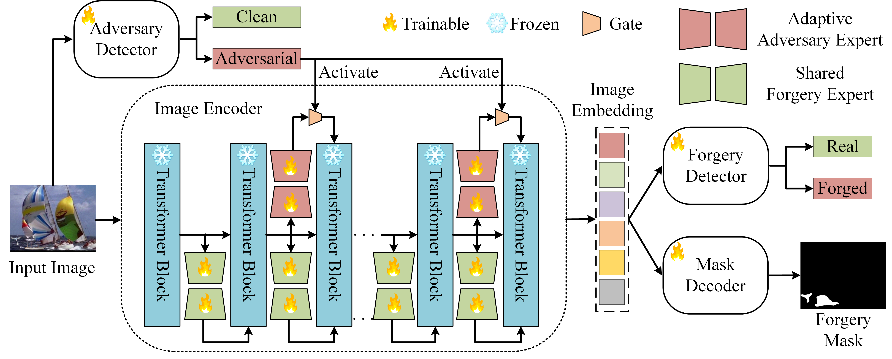

# ForensicsSAM: Toward Robust and Unified Image Forgery Detection and Localization Resisting to Adversarial Attack
[](link-to-your-paper)
[](https://arxiv.org/abs/xxxx.xxxxx)
[](LICENSE)

Official PyTorch implementation of the paper.

---

## 📌 Abstract

Parameter-efficient fine-tuning (PEFT) has emerged as a popular strategy for adapting large vision foundation models—such as the Segment Anything Model (SAM) and LLaVA—to downstream tasks like image forgery detection and localization (IFDL). However, existing PEFT-based approaches often **overlook their vulnerability to adversarial attacks**.  
We show that **highly transferable adversarial images** can be crafted solely via the upstream model—without accessing the downstream model or training data—significantly degrading IFDL performance.

To address this, we propose **ForensicsSAM**, a unified IFDL framework with built-in adversarial robustness, guided by three key ideas:

1. **Shared Forgery Experts**  
   - To compensate for the lack of forgery-relevant knowledge in the frozen image encoder, we insert forgery experts into each transformer block.  
   - These experts are **always active** and **shared** across any input images, enhancing the encoder’s ability to capture forgery artifacts.

2. **Light-weight Adversary Detector**  
   - Learns to capture **structured, task-specific artifacts** in the RGB domain.  
   - Enables reliable detection of adversarial images across various attack methods.

3. **Adaptive Adversary Experts**  
   - Injected into the **global attention layers** and **MLP modules** to progressively correct feature shifts induced by adversarial noise.  
   - **Adaptively activated** by the adversary detector, avoiding unnecessary interference with clean images.

Extensive experiments across multiple benchmarks demonstrate that **ForensicsSAM** not only achieves superior resistance to diverse adversarial attacks, but also delivers **state-of-the-art performance** in both image-level forgery detection and pixel-level forgery localization.


## 🚀 Highlights
- **Novelty**: First to integrate [Key Innovation] into [Task].
- **Performance**: Achieves SOTA on [Dataset A], [Dataset B], with robustness against [Attack Types].
- **Efficiency**: [Training speed / Parameter count / Inference time improvements].
- **Reproducibility**: End-to-end training code and pretrained weights provided.

---

## 📂 Project Structure
```
ForensicsSAM-released/
├── adversary_detector/    # Adversary detector module
├── data/                  # Dataset text lists
├── forensics_sam/         # Core ForensicsSAM model implementation
├── mini_dataloader/       # dataloader
├── segment_anything/      # SAM backbone
├── utils/                 # Helper functions and utilities
├── weight/                # Pretrained model weights
├── inference.py           # Inference script
└── README.md              # Project description
```

---

## 📋 Method Overview
<p align="center">
  <br>
  <em>Figure 1: Overview of the proposed ForensicsSAM framework. Given an input image, ForensicsSAM outputs the image-level detection results (real or forged, clean or adversarial) as well as a pixel-level forgery mask..</em>
</p>


---

## 📊 Results
### Table III  
**Pixel-level forgery localization performance (F1).**  
First and second ranking are highlighted in **bold** and _underline_, respectively.  

| IFDL Method  | CASIAv1+ | MISD   | Columbia | DSO-1  | Coverage | NIST   | CocoGlide | IPM15k | ACDSee | In-the-wild | Average |
|--------------|---------|--------|----------|--------|----------|--------|-----------|--------|--------|-------------|---------|
| MVSS-Net++   | 0.655   | 0.590  | 0.725    | 0.525  | 0.585    | 0.479  | 0.552     | 0.817  | 0.514  | 0.915       | 0.635   |
| IF-OSN       | 0.647   | 0.667  | 0.521    | 0.500  | 0.510    | 0.418  | 0.567     | 0.920  | 0.484  | **1.000**   | 0.623   |
| CAT-Net v2   | 0.843   | 0.796  | 0.805    | 0.525  | 0.645    | 0.500  | 0.536     | 0.935  | 0.489  | 0.989       | 0.706   |
| CoDE         | 0.551   | 0.355  | 0.507    | 0.500  | 0.505    | 0.401  | 0.505     | _0.994_ | 0.489  | **1.000**   | 0.581   |
| TruFor       | 0.811   | **0.957** | **0.983** | **0.930** | _0.685_ | **0.670** | **0.639** | 0.528  | _0.730_ | 0.657       | 0.759   |
| AutoSAM      | 0.588   | 0.450  | 0.606    | 0.500  | 0.590    | 0.445  | 0.506     | 0.482  | 0.490  | 0.980       | 0.604   |
| SAFIRE       | 0.535   | 0.335  | 0.498    | 0.500  | 0.505    | 0.392  | 0.501     | **0.997** | 0.483  | 0.998       | 0.574   |
| FakeShield   | **0.925** | 0.853  | 0.846    | 0.610  | 0.500    | _0.629_ | 0.502     | 0.587  | 0.522  | 0.662       | 0.664   |
| **Ours**     | _0.894_ | _0.936_ | _0.989_  | _0.820_ | **0.730** | _0.776_ | 0.585     | 0.768  | **0.770** | _0.905_     | **0.817** |

---

| IFDL Method  | CASIAv1+ | MISD   | Columbia | DSO-1  | Coverage | NIST   | CocoGlide | IPM15k | ACDSee | In-the-wild | Average |
|--------------|---------|--------|----------|--------|----------|--------|-----------|--------|--------|-------------|---------|
| MVSS-Net++   | 0.532   | 0.692  | 0.737    | 0.334  | 0.516    | 0.366  | 0.543     | 0.421  | 0.368  | 0.421       | 0.486   |
| IF-OSN       | 0.554   | 0.732  | 0.748    | 0.443  | 0.339    | 0.311  | 0.459     | 0.465  | 0.377  | 0.589       | 0.500   |
| CAT-Net v2   | 0.728   | 0.522  | 0.849    | 0.376  | 0.386    | 0.370  | 0.467     | 0.403  | **0.719** | 0.506       | 0.553   |
| CoDE         | 0.734   | 0.780  | 0.920    | 0.464  | 0.372    | 0.347  | 0.592     | 0.470  | 0.528  | 0.614       | 0.602   |
| TruFor       | 0.713   | 0.691  | 0.848    | **0.910** | 0.409    | 0.414  | 0.518     | 0.592  | 0.628  | 0.682       | 0.659   |
| AutoSAM      | 0.740   | 0.763  | 0.916    | 0.464  | 0.628    | 0.436  | 0.545     | 0.640  | 0.479  | 0.608       | 0.626   |
| SAFIRE       | 0.394   | 0.646  | 0.818    | 0.410  | 0.440    | 0.351  | 0.525     | 0.484  | 0.421  | 0.566       | 0.506   |
| FakeShield   | 0.617   | 0.543  | 0.810    | 0.569  | 0.414    | **0.592** | **0.739** | 0.456  | 0.707  | 0.587       | 0.593   |
| **Ours**     | **0.815** | **0.792** | **0.959** | _0.851_ | **0.781** | 0.613  | 0.588     | **0.755** | _0.645_ | **0.734** | **0.753** |


More results and ablation studies are available in the paper.

---

## ⚙️ Installation
```bash
git clone https://github.com/siriusPRX/ForensicsSAM.git
cd your-repo/ForensicsSAM
conda create -n ForensicsSAM python=3.9
conda activate ForensicsSAM
pip install -r requirements.txt
```

---

## 📌 Dataset and Weight Preparation
1. Download the datasets listed below:

| Dataset           | Real  | Forged  | SP | CM | INP |
|-------------------|-------|---------|----|----|-----|
| **Train**         |       |         |    |    |     |
| CASIAv2           | 7491  | 5098    | ✓  | ✓  |     |
| IMD20             | 414   | 2000    | ✓  | ✓  |     |
| FantasticReality  | 16592 | 19423   | ✓  |    | ✓   |
| TamperedCR        | 24462 | 23981   | ✓  | ✓  | ✓   |
| **Test**          |       |         |    |    |     |
| CASIAv1+          | 800   | 920     | ✓  | ✓  |     |
| MISD              | 620   | 296     | ✓  | ✓  |     |
| Columbia          | 183   | 180     | ✓  | ✓  |     |
| DSO-1             | 100   | 100     | ✓  | ✓  |     |
| Coverage          | 100   | 100     | ✓  | ✓  | ✓   |
| NIST              | 875   | 564     | ✓  | ✓  |     |
| CocoGlide         | 512   | 512     | ✓  |    | ✓   |
| IPM15k            | -     | 15000   |    |    | ✓   |
| ACDSee            | 364   | 337     | ✓  | ✓  | ✓   |
| In-the-wild       | -     | 201     |    |    | ✓   |

2. Organize the folders as:
```
data/
  ├── acdsee.txt
  ├── acdsee_au.txt
  ├── casia1.txt
  ├── casia1_au.txt
  ├── CocoGlide.txt
  ├── cocoglide_au.txt
  ├── columbia.txt
  ├── columbia_au.txt
  ├── coverage.txt
  ├── coverage_au.txt
  ├── dso.txt
  ├── dso_au.txt
  ├── ipm15k.txt
  ├── misd.txt
  ├── misd_au.txt
  ├── nist16.txt
  ├── nist16_au.txt
  ├── wild.txt
```
```
weight/
  ├── adversary_detector.pth
  ├── adversary_experts.pth
  ├── forgery_experts.pth
  ├── sam_vit_h_4b8939.pth
```
---

## 💻 Inference
```bash
python inference.py
```

---


---

## 📄 Citation
If you find our work useful, please cite:
```bibtex
@article{peng2025forensicssam,
  title={ForensicsSAM: Toward Robust and Unified Image Forgery Detection and Localization Resisting to Adversarial Attack},
  author={Rongxuan Peng, Shunquan Tan, Chenqi Kong, Anwei Luo, Alex C. Kot, and Jiwu Hunag},
  year={2025}
}
```
